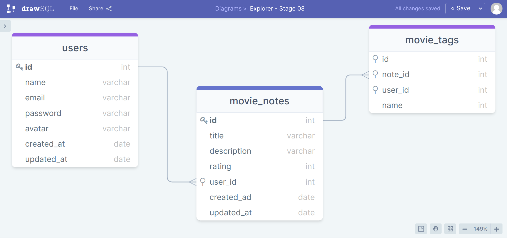

# Api Filmes
 
O desafio era criar uma aplicação em Node.js onde o usuário cadastra um filme, preenche com algumas informações (nome, descrição, nota) e cria tags relacionadas a ele.


[](https://www.linkedin.com/in/jonas-martins-950a30184/)

 <p align="center">
  <a href="#-tecnologias">Tecnologias</a>&nbsp;&nbsp;&nbsp;|&nbsp;&nbsp;&nbsp;
  <a href="#-projeto">Projeto</a>&nbsp;&nbsp;&nbsp;|&nbsp;&nbsp;&nbsp;
  <a href="#-projeto">Iniciar Projeto</a>
  
</p>


## 🚀 Tecnologias

Esse projeto foi desenvolvido com as seguintes tecnologias:

- Nodejs
- Express
- Knex
- Bcryptjs
- Sqlite


## 💻 Projeto




Aprendizado durante o projeto:

- Criptografia de senhas;
- Validação de e-mail;
- Aplicar o cascade para garantir que uma tag será excluída caso o usuário opte por excluir a nota.


## 🚀 Iniciar Projeto

Clonar Projeto e acessar pasta e iniciar o servidor é necessário ter nodeJs instalado e o Visual Studio Code.

### Programas necessários para iniciar projeto
- [NodeJS](https://nodejs.org/en/)
- [Visual Studio Code - Vscode](https://code.visualstudio.com/)

Clone o projeto e acesso a pasta.

```bash
$ git clone https://github.com/jonasmartinsdev/Api_filmes.git
$ cd Api_filmes
```
Com o nodeJs instalado iniciar servidor

```bash
 $ yarn
 $ yarn start
 $ yarn migrate
 ```


 ## 📝 Licença

Esse projeto está sob a licença MIT. Veja o arquivo [LICENSE](LICENSE.md) para mais detalhes.

&nbsp;

<p align="center">Feito com 💜 by Jonas Martins👋</p>


